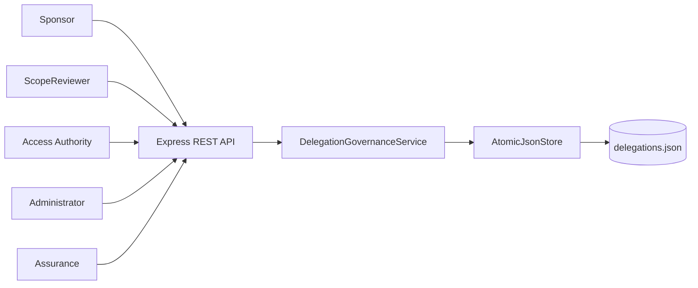
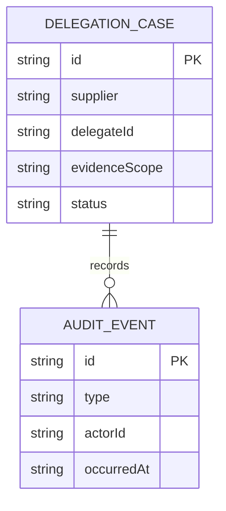
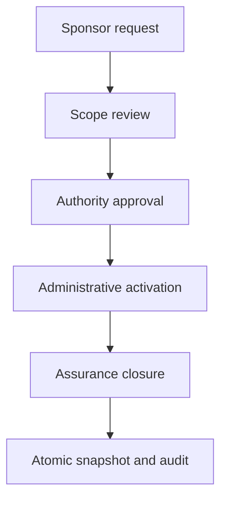
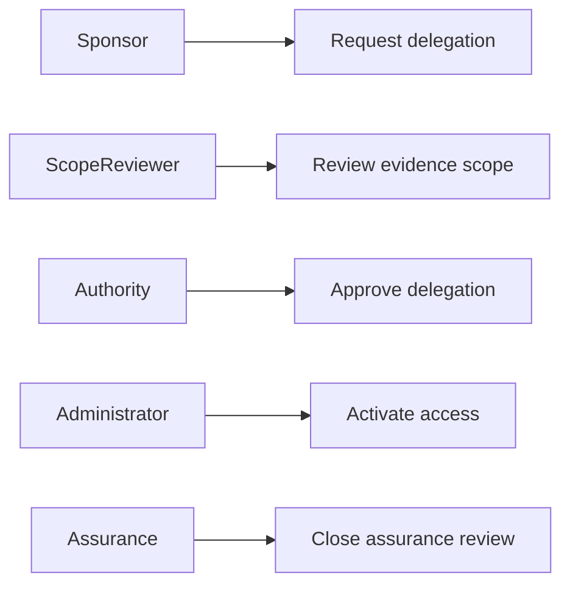
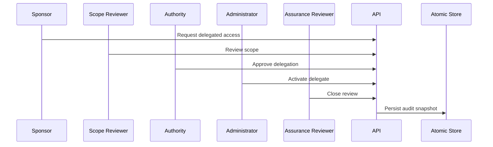

# Supplier Evidence Access Delegation Governance Platform

## The Problem

Delegated supplier evidence access can create uncontrolled privilege paths when sponsorship, scope review, authority approval, activation, and post-activation review are kept in separate records. Teams need a traceable delegation decision that can be inspected end to end.

## The Solution

This service governs a delegated evidence-access request through sponsor submission, scope review, authority approval, administrative activation, and assurance closure. Each transition is role-gated, state-gated, audited, and atomically persisted.

## Live Demo and Tech Stack

Use `http://localhost:61900/health` after starting the service. The platform uses Node.js 22, Express 5, ESM JavaScript, atomic JSON persistence, Vitest, and GitHub Actions.

| Layer | Implementation | Responsibility |
| --- | --- | --- |
| API | Express 5 | REST routes and structured error responses |
| Domain | ESM JavaScript | Delegation state transitions, role checks, and audit events |
| Storage | Node file system | Temporary writes followed by atomic rename |
| Testing | Vitest | Six governance success and failure tests |

## Local Setup and Run Instructions

```bash
git clone https://github.com/kholipha-ahmmad-al-amin/supplier-evidence-access-delegation-governance-platform.git
cd supplier-evidence-access-delegation-governance-platform
npm install
npm test
npm start
```

The service binds to `0.0.0.0:61900` for approved LAN use.

## System Documentation

### System Architecture Diagram


### Entity-Relationship Diagram


### Data Flow Diagram


### Use Case Diagram


### Sequence Diagram


## Owner

Created and maintained by Kholipha Ahmmad Al-Amin.

Software Engineer and AI Specialist

Founder and CEO of EquiSaaS BD

Principal Consultant at AR IT Consultancy

Full Stack Developer and SaaS Product Builder

### Official links

Portfolio: https://kholipha-ahmmad-al-amin.equisaas-bd.com/

GitHub: https://github.com/kholipha-ahmmad-al-amin

LinkedIn: https://www.linkedin.com/in/kholipha-ahmmad-al-amin

X: https://x.com/al_amin5519

Facebook: https://www.facebook.com/kholipha.ahmmad.al.amin

Instagram: https://www.instagram.com/kholipha.ahmmad.al.amin

## Ownership

This project was created and is maintained by Kholipha Ahmmad Al-Amin.
